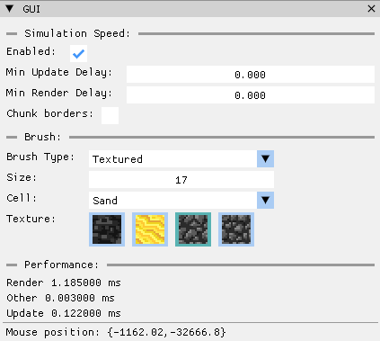

# Project lab report

## Bevezetés
## Project terv

### Cellák chunkokba szervezése

A Chunkokba szervezett adatnak sok előnye van. Egyrész így véges memóriával akár látszólag végtelen lehet a szimuláció tere (természetesen ez nem igaz, hiszen még ha nem is nagy a chunkok száma, akkor is a véges méretű számok miatt nem lehetne az origin-től túl messze lévő chunkokat kezelni), másrészt lehetőséget ad arra, hogy egyszerűen csökkentsük a szimuláció léptetése során frissített cellák számát. 

Az én megoldásomban a szimuláció celláinak nyilvántartásához 2 osztályt használok: `Chunk` és `World`. 
A `Chunk` feladata, hogy egy előre meghatározott számú cellát tároljon, egy statikus méretű array-ben. Ennek az array-nek az élettartama megegyezik a chunk élettartamával. 
A `World` feladata pedig, a szimuláció során létrehozott chunkok kezelése, mely a projektemben a következő módon működik: 
- A world egy hash map-ben tárolja a chunkokat ahol a kulcs a chunk koordinátája.
- Amikor egy cellát akarunk módosítani a `World` osztályon keresztül, a world előszőr megnézi, hogy a cella koordinátájánál van-e már chunk, és ha nincs létrehoz egyet, majd meghivja a chunk `getCell` vagy `setCell` metódusát. 

Az eddig leírt megoldás csak a szükséges memóriát csökkenti, az szimuláció teljesítményét viszont igazából csak csökkenti. Optimalizációra az ad lehetőséget, hogy minden szimulációs lépésnél el tudja dönteni a chunk, hogy őt a következő lépésben kell e frissíteni. Amennyiben úgy döntött, hogy nem, a cellákat frissítő algoritmus nem megy végig a chunkon így rengeteg időt spórol meg. A chunk frissítésének szükségességének eldöntése, a `ChunkState` osztály feladata. 

### Adatorientált struktúra

Már a projekt kezdetén tapasztaltam, hogy memóriában kevesebb helyet foglaló cellákkal sokkal gyorsabb tud lenni a szimuláció. Ennek leginkább az az oka szerintem, hogy kisebb méret mellett több cella tud egyszerre a gyorsítótárba kerülni. Kezdeti kísérleteim során ez akár 20-30%-os teljesítménynövekedést is eredményezett (igaz, a projekt ezen korai szakaszában a szimuláció algoritmusa még nagyon egyszerű volt, így valószínű, hogy a későbbiekben ez az előny valamelyest csökkent). 

A minél kisebb cella érdekében az alábbi módon tárolom a cellákhoz tartozó adatot. A különböző cella fajtákhoz tartozó tulajdonságokat egy union-ba szerveztem és minden értéket a számára szükséges minimális mérető bitfieldben tárolom. 

```c++
union {
	struct {  // Properties common for each cell type
		Type     type : 5;
		unsigned shade : 6;
		...
	}
	
	TypeASpecificProps a;
	TypeBSpecificProps b;
}
```

Ez a megoldás sajnos egyáltalán nem felel meg az OOP elveinek, azonban lényegesen csökkenti cella méretét. 

Az implementáció során egyébként ez nem nagyon okoz extra kellemetlenséget, hiszen új cella típus felvétele igazából leszármazás mellett is komplikált lenne. Az OOP elvek követése mellett az osztálynak polymorph típusnak kellene lennie, hogy a különböző típusok `update()` metódusát meg lehessen hívni a cella típusának compile idejű ismerete nélkül, azonban így egy cella mérete a jelenlegi 4 helyett 16 byte lenne. Virtuális metódusok nélkül viszont nem ismerek olyan megoldást amivel ne kellett volna a cella típusa alapján még kódolás során különböző függvényeket meghívni, ismétlődő kóddal. 

%%
## Megvalósítás


## User Interface

A UI megvalósításához két könyvtárat használtam: SDL és ImGUI. SDL az ablak, egér és billentyűzet kezeléséhez kellett, ImGUI feladata pedig a szimulációval való interakció segítése, valamint a teljesítménnyel kapcsolatos metrikák mutatása. 

Az SDL inicializálásával és eseményeinek kezelésével foglalkozó kódot egy korábbi projektemből vettem át (`IO.h`, `IO.cpp`), ez egy nagyon egyszerű implementáció, amiben csak a feltétlen szükséges funkcionalitást kezelem.  
 
![[imgui-ui.png|center{width=50%}]]


%%